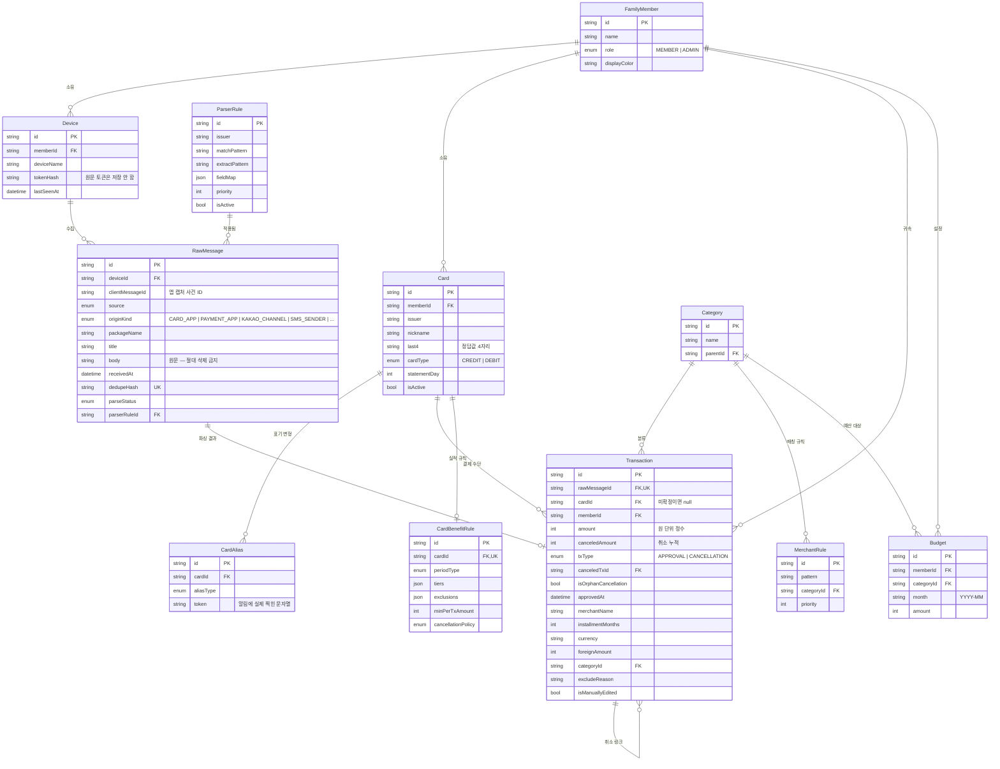

# 01 — 데이터 모델

## 설계 원칙

**원문(`RawMessage`)은 사실이고, 거래(`Transaction`)는 해석이다.**

수집한 알림 원문은 변하지 않는 사실입니다. 그것을 어떻게 읽을지(파싱 규칙)는 시간이 지나며 나아집니다. 그래서 원문은 영구 보관하고, 거래는 언제든 원문에서 재생성 가능한 파생 테이블로 취급합니다.

이 원칙이 스키마 전반에 드러납니다. `isManuallyEdited` 플래그가 있는 것도 재파싱을
안전하게 하기 위해서입니다. Phase 1에서 둔 `Transaction.rawMessageId` unique는 현재
원문 1건↔거래 1건 모델이지만, 한 결제가 여러 앱에서 통지되는 실제 원문을 확보한 뒤
Phase 3 시작 시 복수 원문↔한 거래 대사 모델로 반드시 재검토합니다.
→ [ADR 0007](../adr/0007-user-managed-capture-sources.md)

## ERD



---

## 테이블 상세

### FamilyMember

가족 구성원. 규모가 작아서(4~6명) 별도의 조직 개념 없이 평면 구조로 둡니다.

| 필드 | 타입 | 설명 |
|---|---|---|
| `name` | String **UK** | **로그인 아이디를 겸합니다.** 아래 참고 |
| `passwordHash` | String | bcrypt 해시. 평문은 어디에도 저장하지 않음 |
| `role` | `MEMBER \| ADMIN` | ADMIN만 웹에서 가족 전체를 조회 가능 |
| `displayColor` | String | 가족 대시보드 차트에서 구성원 구분용 |

`name`이 unique인 이유: Auth.js Credentials가 **이름 + 비밀번호**로 인증합니다. 가족 단위라 이메일을 요구하는 것이 과하고, 이름이 자연스러운 식별자입니다. 중복되면 로그인 시 어느 계정인지 결정할 수 없으므로 DB 제약으로 막습니다.

`role`은 **Phase 1 스키마부터** 넣습니다. 실제로 쓰이는 것은 Phase 5지만, 나중에 얹으면 이미 작성된 모든 쿼리를 다시 뒤져야 합니다.

### Device

앱이 설치된 기기 1대 = 1 레코드. **이 프로젝트에서 가장 중요한 조인 키**입니다.

| 필드 | 타입 | 설명 |
|---|---|---|
| `memberId` | FK | 이 기기에서 온 모든 메시지의 소유자 |
| `tokenHash` | String | 토큰 원문은 저장하지 않음. 발급 시 1회만 표시 |
| `lastSeenAt` | DateTime | 수집기 무응답 감지에 사용 (Phase 6) |

**왜 중요한가**: 메시지가 어느 기기에서 왔는지 알면 `memberId`가 자동으로 확정됩니다. 그러면 카드 매칭 시 후보군이 "그 사람의 카드"로 좁혀져서, 마스킹된 카드번호(`1*34`)도 대부분 유일하게 결정됩니다. → [04-card-matching](04-card-matching.md)

### Card

카드 한 장. **집계와 실적의 기본 단위**입니다.

| 필드 | 타입 | 설명 |
|---|---|---|
| `issuer` | String | 카드사. 정규화된 코드 (`SHINHAN`, `KB`, `SAMSUNG`, …) |
| `nickname` | String | 사용자가 붙인 이름. 카드사가 별칭만 보낼 때 매칭에도 사용 |
| `last4` | String(4) | **정답값.** 사용자가 등록 시 직접 입력 |
| `statementDay` | Int | 결제일. 실적 사이클이 `STATEMENT_CYCLE`일 때 사용 |
| `isActive` | Boolean | 해지한 카드를 숨기되 과거 거래는 유지 |

제약: `@@unique([memberId, issuer, last4])`

`last4`를 사용자가 직접 입력받는 이유는, 알림에 마스킹되어 오더라도 대조할 정답이 있어야 하기 때문입니다.

### CardAlias

알림에 실제로 찍히는 카드 표기의 변형을 학습해 두는 캐시.

| `aliasType` | 예시 | 발생 상황 |
|---|---|---|
| `MASKED_DIGITS` | `1*34`, `**34` | 카드사가 일부를 가림 |
| `NICKNAME` | `the Green` | 숫자 없이 카드 이름만 |
| `RAW_TOKEN` | `신한(1234)` | 위 둘로 분류하기 애매한 원문 토큰 |

미확정 큐에서 사람이 "이건 ○○카드야"라고 지정하면 **자동 생성**됩니다. 다음부터 같은 표기가 오면 즉시 매칭됩니다.

### RawMessage

**절대 삭제하지 않는 테이블.** 수집한 알림·문자 원문입니다.

| 필드 | 타입 | 설명 |
|---|---|---|
| `source` | `NOTIFICATION \| SMS \| MANUAL \| STATEMENT` | 수집 경로 |
| `originKind` | enum | 카드사 앱·결제 앱·카카오 채널·SMS 등 세부 출처 |
| `clientMessageId` | String | Android가 캡처 시 부여하고 재전송 동안 유지하는 사건 ID |
| `packageName` | String | 알림을 띄운 앱. SMS면 발신번호 |
| `body` | Text | **원문.** 파싱 실패해도 여기 남아 있음 |
| `dedupeHash` | String **UK** | `deviceId + clientMessageId` 해시. → [02-ingest](02-ingest.md) |
| `parseStatus` | enum | 아래 상태 전이 참고 |
| `parserRuleId` | FK | 어느 규칙으로 파싱됐는지 추적 |

**parseStatus 전이**

```
PENDING ──파싱 성공, 카드 확정──▶ PARSED
   │
   ├──파싱 성공, 카드 미확정──▶ NEEDS_CARD ──사람이 카드 지정──▶ PARSED
   │
   ├──규칙 매칭 실패────────▶ FAILED ──규칙 추가 후 재파싱──▶ PARSED
   │
   └──카드와 무관한 알림────▶ IGNORED
```

`FAILED`와 `NEEDS_CARD`는 미확정 큐에 노출되어 사람이 개입합니다. `IGNORED`는 광고성 알림 등 파싱할 필요가 없다고 판정된 것입니다.

### ParserRule

카드사별 파싱 규칙. **코드가 아니라 데이터**라서 배포 없이 웹 UI에서 고칩니다.

| 필드 | 설명 |
|---|---|
| `matchPattern` | 이 규칙을 적용할지 판정하는 정규식 (예: `^\[?신한카드`) |
| `extractPattern` | 명명 그룹으로 필드를 뽑는 정규식 |
| `fieldMap` | 명명 그룹 → 필드 매핑, 변환 방식 (금액 콤마 제거 등) |
| `priority` | 낮을수록 먼저 적용. 첫 매치 채택 |
| `sampleText` | 이 규칙이 대상으로 하는 문구 예시 (**가공된 샘플만**) |

→ 상세 구조는 [03-parser](03-parser.md)

### Transaction

파싱된 거래. **원문에서 재생성 가능한 파생 테이블**입니다.

| 필드 | 타입 | 설명 |
|---|---|---|
| `rawMessageId` | FK **UK** | Phase 1의 현재 재파싱 키. 복수 출처 대사 구현 전에 변경 검토 필수 |
| `cardId` | FK **nullable** | 미확정이면 null |
| `amount` | Int | **원 단위 정수.** 부동소수점 금지 |
| `canceledAmount` | Int | 취소 누적액. 부분취소가 여러 번이어도 정확 |
| `txType` | `APPROVAL \| CANCELLATION` | |
| `canceledTxId` | FK | 취소 건 → 원거래 링크 |
| `isOrphanCancellation` | Boolean | 원거래를 못 찾은 취소 |
| `installmentMonths` | Int | 0 = 일시불 |
| `currency`, `foreignAmount` | | 해외 결제. 원화 환산액은 `amount` |
| `excludeReason` | String? | 실적 제외 사유. **null이면 실적에 포함** |
| `isManuallyEdited` | Boolean | true면 **재파싱이 덮어쓰지 않음** |

**계산 필드**: `netAmount = amount - canceledAmount`. 모든 집계는 이것을 씁니다. → [불변 규칙 5](../../AGENTS.md)

`excludeReason`을 거래에 직접 저장하는 이유: UI에서 "이 건은 국세라 실적에서 빠졌습니다"라고 설명할 수 있어야 하기 때문입니다. 실적 계산을 블랙박스로 두면 사용자가 숫자를 신뢰할 수 없습니다.

#### 복수 출처 대사 — Phase 3 스키마 게이트

같은 결제가 카드사 앱과 토스 등에서 동시에 오면 `RawMessage`는 출처별로 모두 남지만
집계에는 한 번만 들어가야 합니다. 현재 1:1 관계 그대로 각 원문을 거래로 만들면 중복
집계되므로 Phase 3 파서 구현보다 먼저 다음을 실제 데이터로 결정합니다.

- 한 거래에 여러 `RawMessage`를 근거로 연결하는 관계(연결 테이블 또는 canonical/duplicate 링크)
- 대표 원문 선택 기준과 대표가 바뀌어도 수동 편집을 보존하는 재파싱 절차
- 카드·금액·승인/취소·시각·가맹점이 충분히 일치할 때만 자동 병합하는 규칙
- 애매한 후보를 합치지 않고 사람이 확인하는 상태와 UI
- 원문은 어느 경우에도 삭제하지 않고 `/raw`에서 모든 출처를 계속 확인하는 감사 경로

정확한 관계 형태는 실제 카드사/결제 앱 원문이 며칠치 쌓이기 전에는 확정하지 않습니다.
이는 구현 누락이 아니라 잘못된 의미 병합을 피하기 위한 Phase 3 선행 게이트입니다.

### CardBenefitRule

카드별 실적 규칙. 카드 1장당 최대 1개(`cardId` unique).

| 필드 | 설명 |
|---|---|
| `periodType` | `PREV_CALENDAR_MONTH` (전월 1일~말일) \| `STATEMENT_CYCLE` (결제일 기준) |
| `tiers` | `[{ threshold: 300000, benefitDesc: "...", monthlyCap: 10000 }, ...]` |
| `exclusions` | `["TAX", "GIFT_CARD", "APT_FEE", ...]` |
| `minPerTxAmount` | 건별 최소 인정 금액 (예: 1만원 미만 미인정) |
| `cancellationPolicy` | 취소를 어느 사이클에서 뺄지 |

→ 상세는 [06-benefit-engine](06-benefit-engine.md)

### Category / MerchantRule

`Category.name`은 **unique**입니다. 가족 단위라 카테고리 수가 적고 이름이 곧 식별자 역할을 하며, 시드를 upsert로 쓸 수 있게 됩니다. (`@@unique([name, parentId])`는 `parentId`가 null인 최상위끼리는 Postgres의 NULL 처리 때문에 중복을 못 막아 쓰지 않았습니다.)

가맹점명 → 카테고리 자동 분류. `MerchantRule.pattern`을 `priority` 순으로 적용합니다. 사용자가 미분류 건에 카테고리를 지정하면 규칙이 자동 생성됩니다. (Phase 5)

카테고리는 실적 제외 판정에도 쓰입니다 — "세금·공과금" 카테고리는 대부분의 카드에서 실적 제외 대상입니다.

### Budget

월별 예산. `memberId`와 `categoryId`가 모두 nullable이라 네 가지 조합이 가능합니다.

| memberId | categoryId | 의미 |
|---|---|---|
| 있음 | 있음 | "아버지의 식비 예산" |
| 있음 | null | "아버지 전체 예산" |
| null | 있음 | "가족 식비 예산" |
| null | null | "가족 전체 예산" |

---

## 인덱스

성능이 문제 되는 지점은 정해져 있습니다. 가족 규모(4~6명, 월 수백 건)에서 데이터가 크지는 않지만, 아래는 쿼리 패턴상 필요합니다.

| 테이블 | 인덱스 | 이유 |
|---|---|---|
| `RawMessage` | `dedupeHash` **UNIQUE** | 멱등 수집의 핵심. 없으면 중복 적재 |
| `RawMessage` | `(deviceId, clientMessageId)` **UNIQUE** | 같은 기기의 같은 캡처 사건 재전송 차단 |
| `RawMessage` | `(parseStatus, receivedAt)` | 미확정 큐 조회 — 상태로 걸러 최신순 정렬 |
| `RawMessage` | `(deviceId, receivedAt)` | 기기별 최근 수집 확인 |
| `Transaction` | `rawMessageId` **UNIQUE** | 재파싱 upsert 키 |
| `Transaction` | `(memberId, approvedAt)` | **거의 모든 조회의 기본 패턴** — scope 필터 + 기간 |
| `Transaction` | `(cardId, approvedAt)` | 카드별 집계·실적 산정 |
| `Transaction` | `(cardId, amount, approvedAt)` | **취소 원거래 탐색** — 카드+금액+기간으로 후보를 좁힘 |
| `Card` | `(memberId, issuer, last4)` **UNIQUE** | 카드 매칭 2단계 |
| `CardAlias` | `(token)` | 카드 매칭 1단계 — 가장 먼저 조회됨 |
| `Device` | `tokenHash` **UNIQUE** | 수집 인증 |

`Transaction(cardId, amount, approvedAt)` 복합 인덱스는 취소 매칭 전용입니다. 취소 알림이 올 때마다 "같은 카드에서 같거나 큰 금액을 60일 이내에 쓴 거래"를 찾는데, 이 인덱스가 없으면 풀스캔이 됩니다. → [05-cancellation](05-cancellation.md)

---

## 금액과 시간 규칙

**금액은 원 단위 정수.** 원화에 소수점이 없으므로 `Int`로 충분하고, 부동소수점 오차를 원천 차단합니다. 해외 결제도 원화 환산액을 `amount`에 넣고 원통화 금액은 `foreignAmount`에 따로 둡니다.

**시간은 DB에 UTC, 표시는 KST.** 주의할 지점은 **실적 사이클 계산**입니다. "전월 1일 00:00 ~ 말일 23:59"는 KST 기준이므로, UTC로 저장된 `approvedAt`을 그대로 월 경계와 비교하면 매월 초·말에 9시간만큼 어긋납니다. 사이클 경계 계산은 반드시 KST로 변환한 뒤 수행합니다.

---

## 재파싱 안전성

파싱 규칙을 고친 뒤 과거 전체를 다시 처리할 때, 사람이 손으로 고친 내용을 날려서는 안 됩니다.

```
재파싱 대상: RawMessage 전체 (또는 특정 issuer/기간)

각 원문에 대해:
  1. 대응하는 Transaction 을 rawMessageId 로 찾는다
  2. isManuallyEdited == true  →  건너뛴다 (사람의 판단이 우선)
  3. isManuallyEdited == false →  새 파싱 결과로 upsert
  4. 파싱 실패                  →  parseStatus = FAILED, 기존 Transaction 은 유지
```

4번이 중요합니다. 규칙을 고치다 실수로 기존에 잘 되던 것이 깨져도, 기존 거래는 남아 있어 되돌릴 수 있습니다.

---

## 관련 문서

- [02-ingest](02-ingest.md) — `dedupeHash` 생성 규칙
- [03-parser](03-parser.md) — `ParserRule` 구조와 재파싱 절차
- [04-card-matching](04-card-matching.md) — `CardAlias` 학습
- [05-cancellation](05-cancellation.md) — `canceledAmount` 누적
- [06-benefit-engine](06-benefit-engine.md) — `CardBenefitRule` 해석
